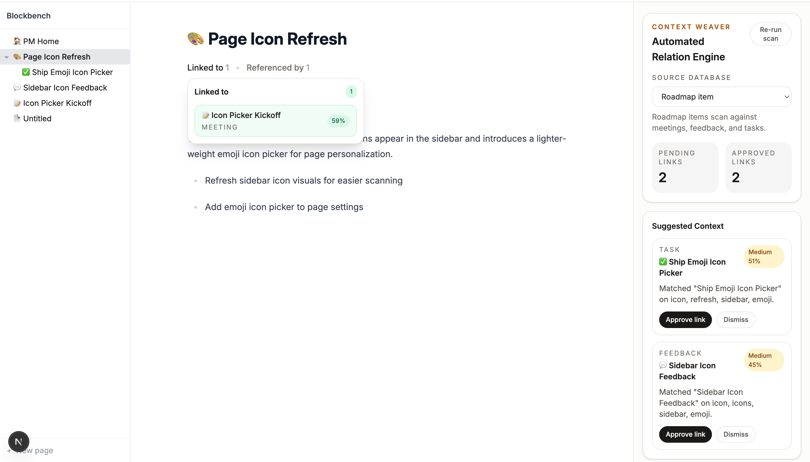

# Context Weaver

**Date:** 2026-07-29  
**Status:** Draft

## Why I Built This

I did not come to this idea from a whiteboard. I came to it from using Notion a lot, and from being around people who use it really well.

As a Notion Campus Ambassador, I have spent a lot of time watching how strong Notion users actually work. What kept standing out to me was not that people fail to capture context. They are usually very good at that. They write the meeting note, create the task, collect the feedback, and update the roadmap. The weak point is what happens after that. The links between those things often stay stuck in human language instead of becoming real structure in the workspace.

I kept noticing the same pattern: a meeting note would clearly be about a roadmap item, a task would obviously come from a piece of feedback, but no one would go back and manually wire those pages together. Not because the relation was unclear. Just because maintaining that structure is tedious, and people move on.

That was one of the reasons I built Blockbench in the first place. Blockbench is a Notion mockup and PM sandbox where I can test product ideas in a lightweight way without pretending to build the full product. Context Weaver came directly out of that environment. I wanted to see what would happen if a Notion-like workspace helped preserve the connections users are already expressing in natural language.

The problem, to me, is not that people forget to write things down. It is that they write things down everywhere.

A PM might have a roadmap page, a meeting note, a feedback summary, and a task page that are all about the same piece of work. But the connection between them is implicit. Someone writes “we discussed the icon picker in kickoff,” but they do not go back and create the relation manually.

That is how a workspace starts to fragment.

Context Weaver is my attempt to fix that in a lightweight way.

The idea is simple: if the system can already read the words on the page, it should be able to notice when two pages obviously belong together and ask, “Do you want to link these?”

Not with a giant AI workflow. Just with a useful nudge at the right moment.

---

## The Core Idea

At its core, Context Weaver does something very simple: it scans a page, compares it to other relevant pages, and suggests likely links.

In the current prototype, I have kept that loop deliberately small:

- a page is classified as a `Meeting`, `Roadmap`, `Task`, or `Feedback` page
- the system scans that page against the right kinds of neighbors
- it suggests related pages with a confidence score and short rationale
- the user can approve or dismiss each suggestion
- approved suggestions become persistent relations
- those relations become navigable from both pages

I am not trying to automate everything.

I am trying to keep useful context from disappearing into prose.

---

## What This Should Feel Like

I want this to feel like the workspace quietly helping.

You write your meeting note. The system notices it probably relates to the roadmap item and the implementation task. It surfaces those suggestions in the side panel. You approve the ones that are right. Now those pages are connected.

That’s it.

I do not want a heavy workflow. I do not want dramatic UI. I do not want an “AI assistant” speech bubble sitting on top of the page. I want a better-maintained workspace graph that feels almost boring in the best possible way.

---

## Who This Is For

I am mainly building this for people who already document their work well, but whose workspace still gets messier as more context piles up.

More specifically, I have in mind someone who lives in Notion all day and moves across different kinds of pages: meeting notes, project docs, tasks, research, feedback, brainstorms, and follow-ups. They are not disorganized. Usually they are the opposite. They write things down, they create systems, and they care about context. But they are moving fast enough that they do not stop every single time to manually maintain the links between those systems.

That is the person I think this helps most: someone who already does the hard part well, but still loses connective tissue as the workspace grows.

I think this is especially relevant for people who:

- work across multiple streams of information and need to move between them quickly
- use Notion or a Notion-like workspace as a second brain
- often revisit old notes, decisions, or research and need to reconstruct how one page relates to another
- want more structure, but do not want the maintenance burden that usually comes with it

---

## What The MVP Actually Does

I want the MVP to stay intentionally narrow.

Right now it does three things:

This screenshot shows the full loop in one place: suggested context in the right rail, approved links surfacing in-page, and linked pages becoming directly navigable.

1. **Suggest**
   It looks at a page and proposes likely related pages.

2. **Confirm**
   The user approves or dismisses each suggestion.

3. **Navigate**
   Once approved, the relation becomes visible and clickable from both places.

That is the whole loop.

No auto-approval. No rewriting the page. No fancy graph view yet. I think the feature becomes much easier to trust if it starts there.

---

## Why This Matters

What I keep coming back to is that most workspace entropy comes from missing links, not missing content.

People already write the meeting note.
They already create the task.
They already collect the feedback.

What they do not do consistently is connect all three.

So the workspace becomes harder to navigate over time, and context gets trapped inside documents that were supposed to make work clearer.

To me, Context Weaver is useful if it does one thing well:

**turn implicit references into explicit, navigable context**

---

## What “Approve Link” Means

I care a lot about this because the feature can easily feel more magical than it really is.

When a user approves a link, the system is not editing the page body or generating content.

It is doing something much simpler:

- storing that suggestion as a real relation in the database
- removing it from the pending suggestion list
- showing it as an approved, navigable connection

I think that is important product behavior because it keeps the feature understandable.

Approval means:

**“Yes, these two pages belong together.”**

---

## The Product Bet

The product bet I am making is that relation maintenance is one of those high-friction, low-prestige tasks that no one wants to do manually, but everyone benefits from once it exists.

If the system can make that lightweight and trustworthy, then the workspace becomes more useful without asking the user to do much more work.

That feels like exactly the kind of leverage worth prototyping.

---

## What Success Looks Like

To me, success is not “the AI linked everything.”

Success is:

- the suggestions feel reasonable
- approval is fast
- the page becomes easier to navigate after approval
- a PM can explain the feature in one sentence

The one-sentence version I want someone to walk away with is:

**“Context Weaver notices when pages are clearly related and helps you preserve those links.”**

---

## What I Am Not Trying To Do Yet

I am not trying to build:

- a full semantic knowledge graph
- fully automatic linking
- custom relation schemas
- collaboration workflows
- a dense database-management UI

That can all come later.

Right now, the product question I care about is much smaller:

**If the workspace suggested the right links at the right time, would people actually want them?**

---

## Open Questions

These are the product questions I still think are genuinely open:

1. How often are the suggestions right enough to trust?
2. Should dismissed suggestions stay gone, or come back after major edits?
3. Should approved links remain lightweight navigation only, or eventually become visible page properties?
4. How subtle can the in-page UI be before people stop noticing it?
5. Should there be a manual “create relation” path, even if the engine never suggested it?

---

## Current Prototype

What I like about the current Blockbench prototype is that it already proves the basic loop:

- classify page
- scan for related pages
- generate suggestions
- approve or dismiss
- persist approved relations
- navigate through approved links

So the next phase, at least for me, is not proving whether this can work technically.

The next phase is deciding whether this feels useful, trustworthy, and lightweight enough to deserve becoming a real product direction.
